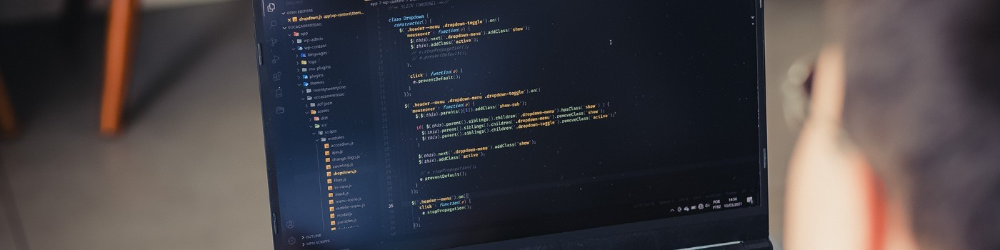

<h2>Sobre</h2>

Diego é Desenvolvedor Front-End criativo e um eterno curioso que ama estudar programação, UX/UI design e outras tecnologias, sempre buscando se aperfeiçoar mais.

Possui um sólido conhecimento em tecnologias HTML, CSS, JavaScript, PHP, Sass, SVG e WordPress, e atualmente tem buscado novas experiências com React, Vue e Nuxt. Diego também tem noção em ferramentas de design da família Adobe: Photoshop, Illustrator, InDesign, Animate, XD, Premiere e After Effects, e outros softwares de interface como o Figma.

Ao longo dos anos realizou estudos de maneira autodidata e fez muitos cursos da área em plataformas como Udemy, Udacity, UpInside, Cataline, Origamid, freeCodeCamp, edX, Codecademy e outras. Atualmente está cursando Sistemas para Internet na instituição de ensino Descomplica.

Realizou diversos feitos ao longo de sua carreira como: projetos em agências, sites de Relação com Investidores (RI), coparticipou no desenvolvimento do portal de investidores da MZ Group, e coordenou diversos desenvolvedores em formação.

Diego é observador, amigável, empático e determinado a trazer resultados positivos naquilo que está cuidando.

Gostaria de conhecer mais? Mande uma mensagem.

<a href="./docs/README.md">Conteúdo</a>
